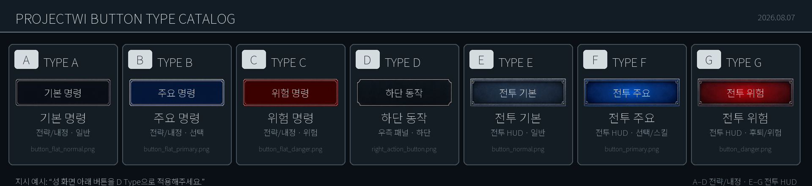
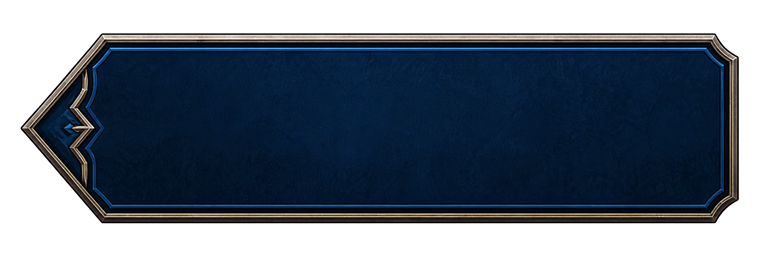

# ProjectWI 버튼 타입 가이드

**작성일:** 2026-08-07  
**목적:** UI 작업을 요청할 때 버튼 형태를 `A Type`부터 `H Type`까지 짧고 일관되게 지정하기 위한 기준 문서

신규 H Type 원본 미리보기:

## 공식 타입 분류

| 타입 | 공식 명칭 | 이미지 에셋 | 현재 주요 사용처 | 9-Slice |
|---|---|---|---|---|
| **A Type** | 전략 기본 명령 버튼 | `button_flat_normal.png` | 전략·영지 관리 화면의 일반 행동, 모달 기본 버튼 | 상하좌우 3 |
| **B Type** | 전략 주요 명령 버튼 | `button_flat_primary.png` | 선택 상태, 확인, 다음 단계와 주요 행동 | 상하좌우 3 |
| **C Type** | 전략 위험 명령 버튼 | `button_flat_danger.png` | 파기, 후퇴 확인, 위험 행동과 경고성 명령 | 좌우 18 / 상하 16 |
| **D Type** | 직사각 금속 동작 버튼 | `right_action_button.png` | 하단 전역 명령(군사~월간 보고), 우측 정보·성 명령 패널의 독립 행동 | 좌우 28 / 상하 20 |
| **E Type** | 전투 기본 명령 버튼 | `button_normal.png` | 전투 HUD의 일반 명령 | 좌우 28 / 상하 24 |
| **F Type** | 전투 주요 명령 버튼 | `button_primary.png` | 전투 HUD의 선택 명령과 영웅 스킬 | 좌우 28 / 상하 24 |
| **G Type** | 전투 위험 명령 버튼 | `button_danger.png` | 전투 HUD의 후퇴와 위험 행동 | 좌우 28 / 상하 24 |
| **H Type** | 장식형 주요 진행 버튼 | `button_type_h.png` | 다음 턴·계속·확정처럼 넓게 배치하는 대표 행동 | 좌 112 / 우 32 / 상하 32 |

모든 원본 이미지는 `Assets/Resources/UI/Generated`에 있습니다. 타입명은 업무 지시를 위한 공식 별칭이며, Unity 참조가 끊기지 않도록 실제 에셋 파일명은 변경하지 않습니다.

## 선택 기준

- 전략 지도·영지 관리·공통 모달에서는 **A/B/C Type**을 우선합니다.
- 하단 전역 명령 바의 군사~월간 보고 버튼과 우측 패널의 독립 행동 버튼은 **D Type**을 사용합니다.
- 전투 HUD에서는 **E/F/G Type**을 사용해 전략 화면과 시각 영역을 구분합니다.
- 화면의 대표 진행 행동을 넓고 장식적인 형태로 강조할 때는 **H Type**을 사용합니다.
- 일반 행동은 A 또는 E, 핵심 행동은 B 또는 F, 위험 행동은 C 또는 G를 사용합니다.
- 색만으로 의미를 구분하지 않고 버튼 문구에도 행동과 결과를 명시합니다.
- 버튼을 확대할 때는 표의 9-Slice 값을 유지해 모서리 장식이 늘어나지 않게 합니다.

## 업무 지시 예시

- `성 화면 아래 버튼을 D Type으로 설정해주세요.`
- `다음 턴 버튼은 B Type, 캠페인 포기 버튼은 C Type으로 적용해주세요.`
- `전투의 사수 명령은 E Type, 현재 선택 명령은 F Type으로 표시해주세요.`
- `후퇴 버튼은 G Type을 사용하고 위험 행동 문구를 유지해주세요.`
- `다음 턴 버튼을 H Type으로 설정해주세요.`

## 버튼이 아닌 유사 에셋

다음 이미지는 버튼과 외형이 비슷하지만 정보 표시용 패널이므로 A~G 타입에 포함하지 않습니다.

- `right_notice_row.png`: 일반 알림 행
- `right_danger_row.png`: 위험 알림 행
- `right_objective_card.png`: 목표 카드
- `right_panel_header.png`: 우측 패널 제목
- `right_panel_frame.png`: 우측 패널 외곽

