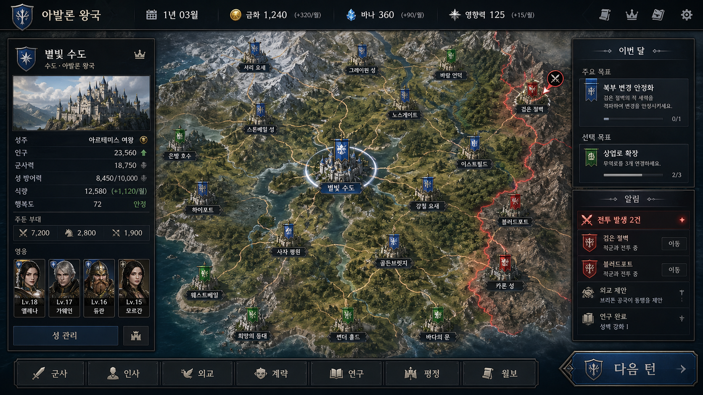
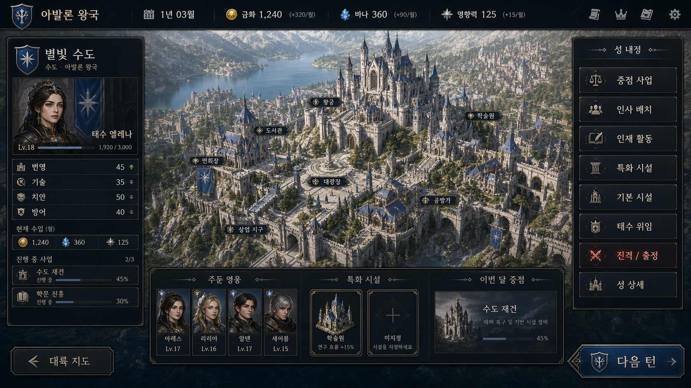

# ProjectWI UI 후속 작업 인수인계 보고서

작성일: 2026-08-06  
목적: UI 작업을 다른 세션에서 즉시 이어갈 수 있도록 목표 화면, 현재 구조, 수정 순서와 완료 기준을 고정합니다.

## 1. 목표 기준 이미지

다음 두 이미지를 UI 작업의 최우선 시각 기준으로 사용합니다. 새로운 해석으로 레이아웃을 다시 설계하기보다 화면의 비율, 정보 계층과 밀도를 최대한 그대로 옮깁니다.

### 전략 지도 화면

- 경로: `GameDocuments/UIConcepts/ProjectWI_Strategy_UI_Concept_V1.png`
- 핵심 구조: 상단 HUD / 좌측 선택 성 정보 / 중앙 대륙 지도 / 우측 목표·알림 / 하단 전역 명령 / 우측 하단 다음 턴
- 화면의 주인공은 중앙 지도이며, 좌우 패널은 지도보다 어둡고 좁아야 합니다.
- 성 노드는 사각 텍스트 박스가 아니라 성채와 진영 깃발 이미지로 보여야 합니다.

### 영지 관리 화면

- 경로: `GameDocuments/UIConcepts/ProjectWI_Castle_Administration_UI_Concept_V1.png`
- 핵심 구조: 공통 상단 HUD / 좌측 성·영지관·수치 / 중앙 성 전경 / 우측 성 명령 / 하단 영웅·시설·이번 달 중점 / 양쪽 하단 이동 버튼
- 성 전경이 화면의 주인공이며, 메뉴는 전경을 완전히 가리지 않는 고정 패널이어야 합니다.
- 주둔 영웅과 특화 시설은 명확히 분리하고 각각 독립적으로 스크롤해야 합니다.

## 2. 고정할 디자인 방향

- 배경과 패널: 검정에 가까운 흑청색, 약한 청회색 질감
- 프레임: 얇은 은색 테두리와 제한적인 황동 포인트
- 선택/주요 행동: 깊은 남색
- 위험/전투: 어두운 적색
- 일반 텍스트: 따뜻한 백색
- 보조 텍스트: 청회색
- 진영색: 지도 깃발과 외교·전선 정보에만 사용
- 제목·화면명: `Noto Serif KR`
- 숫자·작은 정보·버튼: `Noto Sans KR`
- 버튼과 패널의 모서리는 9-Slice를 사용하여 크기를 늘려도 장식 두께가 변하지 않아야 합니다.
- 작은 글자에 Text Outline을 사용하지 않습니다. 크기와 명도 차이로 계층을 만듭니다.

## 3. 현재 구현 상태

현재 UI는 UI Toolkit으로 구성되어 있으며 주요 화면 계층은 정적으로 UXML에 존재합니다. 런타임 코드가 UI를 새로 생성하는 방식으로 되돌리지 않습니다.

| 항목 | 현재 상태 | 후속 판단 |
|---|---|---|
| 전략 지도 3열 구조 | UXML에 좌·중·우 패널 존재 | 시안 비율과 여백을 다시 맞춰야 함 |
| 영지 관리 구조 | 좌측 현황, 중앙 전경, 우측 명령, 하단 슬롯 존재 | 시안의 중앙 전경 면적과 하단 카드 밀도에 맞춰야 함 |
| 60개 성 노드 | UXML에 고정 배치 | 마커 크기·명패·선택광·겹침을 실제 지도에서 조정해야 함 |
| 영웅 슬롯 | 8개 정적 슬롯과 독립 ScrollView 존재 | 초상 비율, 레벨·이름 계층, 카드 간격 개선 필요 |
| 특화 시설 | 2개 정적 슬롯과 독립 ScrollView 존재 | 영웅 영역과 시각적으로 더 분리 필요 |
| 공통 팝업 | 고정 헤더와 스크롤 본문 구조 존재 | 시안 테마, 패딩과 버튼 정렬을 화면별로 검증해야 함 |
| 폰트 | Noto Serif KR/Sans KR 포함 | 역할이 섞인 선택자와 작은 버튼을 전수 확인해야 함 |
| 이미지 에셋 | 버튼·아이콘·패널·성 노드·카드 에셋 존재 | 기존 파일은 삭제하지 않고 적합한 곳에 재사용 |
| USS | 약 660줄이며 과거 테마와 후속 덮어쓰기가 누적 | 최종 선택자 우선순위를 정리할 필요가 있음 |
| UI Controller | 약 3,360줄 | 새 레이아웃 생성 코드를 추가하지 말고 데이터 바인딩만 유지 |

주의: 최신 `Assets/Screenshots/UI_Current_Preview.png`와 `UI_Castle_Administration_Preview.png`는 현재 둘 다 캠페인 시작 레이어가 열린 상태를 캡처해 전략 지도·성 화면의 최종 비교 자료로 사용할 수 없습니다. 후속 세션은 새 캠페인 진입 후 전략 지도와 영지 관리 화면을 각각 다시 캡처해야 합니다.

## 4. 주요 수정 파일

### 레이아웃

- `Assets/UI/Administration/WIAdministration.uxml`
  - 전략 화면의 좌·중·우 패널과 하단 명령
  - 성 화면의 좌측 현황, 중앙 전경, 우측 명령과 하단 슬롯
  - 60개 성 노드, 영웅 8칸, 시설 2칸은 정적 요소로 유지

### 스타일

- `Assets/UI/Administration/WIAdministration.uss`
  - 화면 비율, 패딩, 글자 크기, 색, 9-Slice와 상태 스타일
  - 같은 선택자가 여러 구간에서 반복 덮어써지는 부분을 정리
  - 1920×1080을 기준으로 먼저 맞춘 뒤 1366×768 대응 규칙 작성

### 데이터 바인딩

- `Assets/Scripts/Administration/WIAdministrationUIController.cs`
  - 레이아웃을 코드로 만들지 않음
  - UXML 요소 조회, 데이터·Sprite 연결, 화면 전환과 상호작용만 담당
  - 시각 조정 때문에 새로운 `VisualElement`, `Button`, `Label` 생성 코드를 추가하지 않음

### 재사용 이미지

- `Assets/Resources/UI/Generated/map_castle_*.png`: 진영별 성채·깃발
- `Assets/Resources/UI/Generated/icon_flat_*.png`: 하단 명령 아이콘
- `Assets/Resources/UI/Generated/hud_flat_*.png`: 상단 자원 아이콘
- `Assets/Resources/UI/Generated/button_flat_*.png`: 일반·주요·위험 버튼
- `Assets/Resources/UI/Generated/right_*.png`: 우측 목표·알림·명령 패널
- `Assets/Resources/UI/Generated/hero_slot_card.png`: 영웅 카드
- `Assets/Resources/UI/Generated/facility_slot_card.png`: 시설 카드
- `Assets/Resources/UI/Generated/castle_stat_*.png`: 성 수치 카드
- `Assets/Fonts/NotoSerifKR-VariableFont_wght.ttf`
- `Assets/Fonts/NotoSansKR-VariableFont_wght.ttf`

기존 이미지 파일은 삭제하지 않습니다. 현재 화면에서 사용하지 않더라도 팝업, 보조 패널이나 이후 변형 화면에서 재사용할 수 있습니다.

## 5. 후속 작업 순서

### 1단계 — 실제 비교 캡처 확보

- 캠페인 시작 레이어를 닫고 1920×1080 전략 지도 캡처
- 아발론 소유 성을 열고 1920×1080 영지 관리 캡처
- 목표 시안 두 장과 각각 나란히 비교
- 동일 화면을 1366×768에서도 캡처

완료 기준: 캠페인 시작 화면이 아니라 실제 전략·성 화면이 캡처되어야 합니다.

### 2단계 — 공통 상단 HUD

- 문장, 진영명, 날짜, 금화, 마나, 영향력의 폭과 간격을 시안에 맞춤
- 자원별 아이콘과 월 증가량의 기준선을 통일
- 우측 시스템 아이콘은 작은 단색 아이콘으로 정렬
- 전략 화면과 성 화면에서 위치가 한 픽셀도 달라지지 않게 공통 사용

완료 기준: 두 화면을 전환해도 상단 HUD가 움직이지 않습니다.

### 3단계 — 전략 지도 화면

- 좌측 패널 폭을 시안 비율로 고정하고 성 이미지·수치·영웅 카드 계층 정리
- 중앙 지도 영역을 최대화하고 60개 노드 겹침 조정
- 성 노드를 진영 깃발+성채+짧은 명패로 통일
- 선택 성 광륜, 적대 전선과 이동선 명도를 구분
- 우측 목표와 알림을 독립 카드로 분리
- 하단 명령 7개와 다음 턴 버튼의 높이·기준선 통일

완료 기준: 1920×1080에서 중앙 지도가 화면 폭의 절반 이상을 유지하고 좌우 패널이 지도 위를 침범하지 않습니다.

### 4단계 — 영지 관리 화면

- 중앙 성 전경을 가장 큰 면적으로 유지
- 좌측에 성명·영지관·4대 수치·수입·진행 사업을 세로 계층화
- 우측 영지 관리 명령을 동일 높이 버튼으로 정렬
- `진격 / 원정`만 위험색 사용
- 하단 주둔 영웅, 특화 시설, 이번 달 중점을 시안처럼 세 영역으로 분리
- 영웅과 시설은 각각 독립 ScrollView 유지
- 대륙 지도와 다음 턴 버튼을 좌우 하단에 고정

완료 기준: 영웅이 8명이고 시설이 2개여도 영역 밖으로 넘치지 않으며, 시설이 영웅 목록 아래에 섞이지 않습니다.

### 5단계 — 버튼·팝업·상태 통일

- 일반, 호버, 눌림, 선택, 비활성, 위험 상태를 이미지 에셋 기준으로 통일
- 호버 시 과거 단색 배경이 이미지 위에 덮이지 않게 Tint 중심으로 조정
- 모든 팝업은 제목·닫기 고정, 본문 스크롤, 필요한 경우 하단 행동 고정
- 긴 한글·영문과 125% UI 스케일에서도 줄바꿈·말줄임·스크롤 검증

완료 기준: 버튼 장식 모서리가 늘어나지 않고, 텍스트가 팝업과 버튼 경계를 넘지 않습니다.

### 6단계 — USS 정리와 회귀 검증

- 과거 황금·양피지 테마와 현재 흑청색 테마의 중복 선택자 정리
- 화면별 선택자보다 공통 토큰과 공통 상태 선택자를 우선
- 데이터 바인딩용 UXML `name`은 변경하지 않거나 Controller와 동시에 수정
- 기존 `WIUILayoutFormattingTests` 실행
- Unity Console 오류 확인

완료 기준: 1920×1080과 1366×768 전략·성 화면 캡처, 호버/선택/비활성 캡처, EditMode UI 검사 통과가 모두 남아 있어야 합니다.

## 6. 작업 금지 사항

- UI를 C#에서 런타임 생성하지 않습니다.
- 시안에 없는 신규 메뉴나 건물 기능을 추가하지 않습니다.
- 성 노드, 영웅 슬롯과 시설 슬롯을 런타임 생성 구조로 되돌리지 않습니다.
- 기존 이미지 에셋을 정리한다는 이유로 삭제하지 않습니다.
- UI 작업 중 재미 검증·AI·전투 밸런스 로직을 함께 변경하지 않습니다.
- `WIAdministrationUIController.cs`에 장식, 좌표와 스타일 결정 코드를 추가하지 않습니다.

## 7. 다음 세션 시작 체크리스트

- [ ] UnityMCP `ProjectWI` 연결 확인
- [ ] `GameDocuments/ProjectStatus.md` 확인
- [ ] 본 문서와 목표 시안 두 장 확인
- [ ] 현재 전략 지도 1920×1080 캡처
- [ ] 현재 영지 관리 1920×1080 캡처
- [ ] 목표와 현재의 차이를 항목별로 표시
- [ ] UXML 정적 구조를 유지한 채 USS부터 조정
- [ ] 필요한 경우에만 기존 생성 에셋을 재가공
- [ ] 1366×768 축소 검증
- [ ] UI EditMode 검사와 Console 오류 확인
- [ ] 변경 후 비교 캡처와 문서 갱신

## 8. 최종 목표

기능을 추가하는 작업이 아니라, 이미 연결된 전략 지도와 성 중심 영지 관리 흐름을 두 시안의 시각적 완성도에 가깝게 정돈하는 작업입니다. 우선순위는 `정보 구조 일치 → 화면 비율 일치 → 타이포그래피 → 이미지·상태 디테일` 순서입니다. 사람의 미적 판단이 필요한 마지막 미세 간격과 색감은 비교 캡처를 보면서 사용자와 함께 조정합니다.
